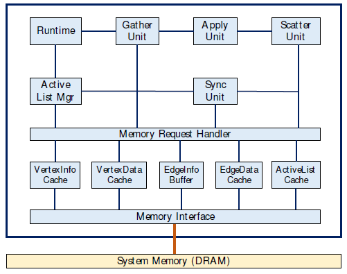

Energy Efficient Architecture for Graph Analytics Accelerators

Corresponding author

Muhammet Mustafa Ozdal†, Serif Yesil†, Taemin Kim\*, Andrey Ayupov\*, John
Greth\*, Steven Burns\*, and Ozcan Ozturk†

†Bilkent Univ. Ankara, Turkey

\*Intel Corp. Hillsboro, OR 97124

Keywords

Graph-Parallel; Graph Analytics Applications

Summary

*Challenge*

Many existing works focus on accelerating compute-intensive tasks using
programmable hardware (e.g. GPUs, CPU vector extensions such as SSE and AVX) or
custom hardware. A common characteristic of these applications is the regularity
and the abundance of data and thread level parallelism. However a certain class
of **graph analytics applications** with **irregular execution patterns** make
them hard to accelerate using existing platforms.

To be detailed, common characteristics of iterative graph-parallel applications
have been studied recently, and the desired architectural features have been
identified as follows:

1.  **Asymmetric Convergence**: The number of iterations each vertex needs to be
    processed before convergence may vary significantly for graph analytics
    applications.

2.  **Asynchronous Execution**: In contrast to bulk-synchronous iterative
    algorithms, there are **no well defined iterations in an asynchronous
    algorithm**, and the vertices can access the latest data computed by their
    neighbors. Although more work efficient, an asynchronous implementation may
    run slower because of potential synchronization overheads. Race conditions
    are possible.

3.  **Memory Access Bottlenecks**: It is known that memory access can be the
    main bottleneck for graph analytics workloads. The main reason is that a
    **small amount of computation** is typically performed **per vertex and
    edge**, but a **large number of vertices and edges** need to be processed
    for large graphs.

4.  Load Imbalance: Vertex degrees of real graphs (e.g. social networks) follow
    the Power law distribution, where a small percent of vertices cover most of
    the edges. **Assigning vertices to threads statically can lead to severe
    load imbalances**.

General Purpose CPUs meet surprisingly low IPCs (most below 1.0), and GPUs can’t
handle the graph analysis problem well because of the SIMD nature of GPU leading
to both control

and memory divergence due to irregularity of graph applications.

*Contribution*

Focus on such a large class of graph applications, the authors

1.  Propose an architecture specifically optimized for vertex-centric,
    iterative, graph-parallel applications with irregular access patterns and
    asymmetric convergence. The proposed architecture supports the more
    work-efficient asynchronous execution

2.  Provide cycle-accurate and synthesizable SystemC models that implement the
    proposed architecture template

3.  Provide an experimental study that compares the area, power, and performance
    of the generated hardware accelerators with CPU implementations

The proposed architecture include specialized processing unit and memory
hierarchy for graph analysis algorithms. Tens of vertices and hundreds of edges
are processed simultaneously to achieve high levels of memory-level parallelism,
scale-free graphs are handled through dynamic load balancing, while
Synchronization between concurrently processed vertices and edges is done in the
Sync Unit (SYU) module specifically designed for graph processing. The
accelerator are tested for different graph applications including PageRank (PR),
Loopy Belief Propagation (LBP), Stochastic Gradient Descent (SGD), and Single
Source Shortest Path (SSSP).

*Result*

Compared to a 24 core high end IvyBridge server system, the hardware
accelerators generated by the proposed template outperformed by up to 3x in
terms of performance, and the physical-aware logic synthesis shows up to 65x
better power consumption with significantly smaller area. GPU system is not
compared due to the work-efficiency advantages of asynchronous execution and
asymmetric convergence.

*Possible Improvements*

The paper proposed a hardware accelerator specific for graph analysis problem,
which is not significantly related to neural networks. The computation patterns
of graph algorithms differ from those of NN algorithms. The paper is structural
completed, using template that receive application-level data structures and
operations to generate hardware accelerators for each application.
