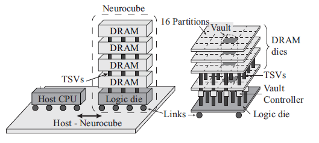
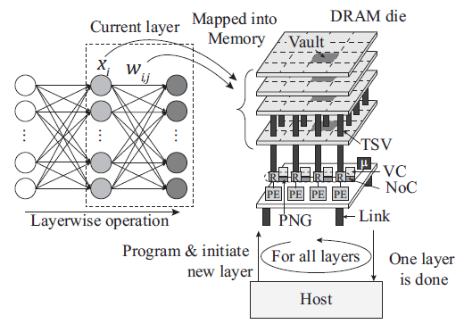
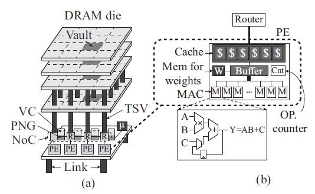

Neurocube: A Programmable Digital Neuromorphic Architecture with High-Density 3D
Memory

Corresponding author

Duckhwan Kim∗, Jaeha Kung∗, Sek Chai†, Sudhakar Yalamanchili ∗, and Saibal
Mukhopadhyay∗

∗School of Electrical and Computer Engineering, Georgia Institute of Technology,
Atlanta, Georgia, USA

†SRI International, Princeton, New Jersey, USA

Keywords

Neural nets; Neurocomputers; Neuromorphic computing;

Hybrid Memory Cube，Memory Centric Computing，In-memory Neuromorphic Processing

Summary

*Challenge*

Neural network is highly parallel, with opportunities to exploit data and thread
level parallelism. However the overall system performance is often limited due
to insufficient memory bandwidth and network latency. Low operational density
(ops/byte), poor spatial locality, and massive parallelism serve to stress
**memory bandwidth**.

Early on-chip cache solutions were not scalable to large neural networks or
complex applications over large data sets, and even the use of high density
eDRAM on-chip cache memory cannot support large input image sizes and/or deeper
leaning networks on-chip underscoring the pressure on **off-chip memory
bandwidth**.

*Contribution*

This paper introduces the Neurocube: a programmable, scalable, power efficient
digital architecture platform for computing neuro-inspired algorithms. The
approach is based on:

1.  **In-memory neuromorphic processing**. The Neurocube integrates a fine
    grained, highly parallel, **compute layer within a 3D high-density memory
    package**, the hybrid memory cube (HMC)

2.  **Memory-centric neural computing (MCNC)**. The data-driven nature and
    statically known memory access patterns of neuro-inspired algorithms is
    exploited to implement a programmable memory system to drive data flow
    enabled compute units. **No traditional instruction set model is used** in
    order to improve energy and compute efficiency.

3.  **Programmable Neurosequence Generator**. Host programming interface is a
    set of memory-based **programmable state machines** (neurosequence
    generators) that exposes abstractions for connectivity and synaptic weights
    as the vehicle for programming different neural nets.

The approach also includes a NoC design.

*Result*

The performance and power of Neurocube is analyzed for both training and
inference of ConvNN (Scene Labeling). Neurocube synthesized with 15nm can
deliver throughput up to 132GOPs/s during inference and 127GOPs/s during
training within a compute power envelope of 3.4W in 15nm FinFet. The simulations
project ∼4X improvement in computing power-efficiency (GOPs/s/W) over reported
GPU based implementation while providing the programmability and scalability
advantages over ASIC/FPGA platforms.

*Comments*

The author used Hybrid Memory and In-Memory Computing to solve the well-known
memory wall problem in NN. It seems to be a good methods to get rid of on-chip
cache limitation and complex memory hierarchy designing (NoC includes cache
through), but the usage of HBM device make it hard to test in real world. The
Programmable Neurosequence Generator (PNG) are only focused on Dense and Conv
layer in the paper, it’s not clear if PNG can handle all possible kind of
layers, and how flexible and programmable is the system.
