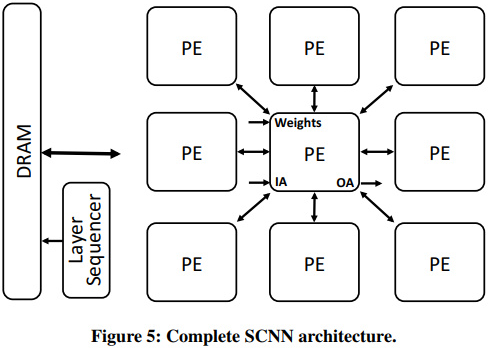

Summary of “SCNN…”

This paper designs a dataflow and an efficient hardware architecture that can
efficiently handle sparse CNNs. The main idea is to skip the case of zero
multiplication in weight and activation. In order to achieve the effect of
speeding up and reducing power consumption.

The dataflow this paper proposed is called PT-IS-CP-sparse
(PlanarTiled-InputStationary-CartesianProduct-sparse). It handles dataflow in
two modes, dense and sparse. For the detail of this dataflow, please refer to
the original paper.

The architecture of SCNN is below:

As shown in the figure above, the accelerator contains a set of simple
interconnected PE arrays. Each PE receives the weight and activation of multiple
channels and outputs the output of multiple channels. Adjacent 8 PEs are
interconnected to exchange the halo values. (For detail of halo values, please
refer to the original paper.)

The overall data flow control is orchestrated by the layer sequencer, which
controls a DRAM controller for broadcasting weight to all PEs, and activation
can flow in or out.

Combine the proposed data flow, SCNN facilitates efficient delivery of those
weights and activations to a multiplier array, where they are extensively
reused; product accumulation is performed in a novel accumulator array. On
contemporary neural networks, SCNN can improve both performance and energy by a
factor of 2.7x and 2.3x, respectively, over a comparably provisioned dense CNN
accelerator.
